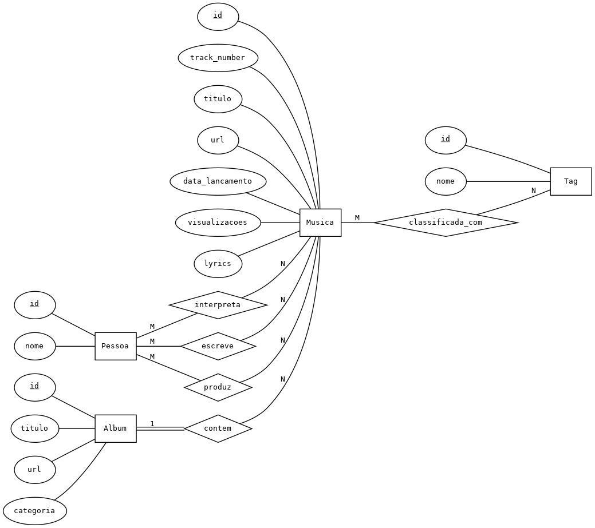
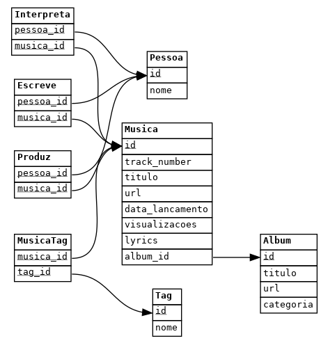

# Taylor Swift Discography Database

**Projeto feito no âmbito de Bases de Dados (CC2005)**

Base de dados relacional sobre a discografia de Taylor Swift: álbuns, músicas, artistas, escritores, produtores e tags.

---

## Instalação e Execução

### Pré-requisitos
```bash
python3 --version  # Python 3.9+
pip3 install Flask pandas
```

### Setup
```bash
git clone https://github.com/andrefmonteiro/taylor-swift-database.git
cd taylor-swift-database
python3 populate_db.py  # Opcional - BD já vem populada
python3 server.py
```

**Aceder:** http://localhost:9000

---

## Modelação

### Modelo Entidade-Relacionamento


**Entidades:** Album, Musica, Pessoa, Tag  
**Relacionamentos:** Album 1:N Musica, Pessoa M:N Musica (Interpreta, Escreve, Produz), Musica M:N Tag

### Modelo Relacional


**Tabelas:** Album, Musica, Pessoa, Tag, Interpreta, Escreve, Produz, MusicaTag  
**3ª Forma Normal** - sem dependências funcionais transitivas

---

## Funcionalidades

### Endpoints por tabela
- `/{tabela}/` - Lista todos os registos
- `/{tabela}/<id>` - Detalhes de um registo
- Exemplo: `/album/`, `/album/1`

### Interrogações SQL (10+)
- `/songs_album/` - Músicas por álbum
- `/only_taylor_writer_songs/` - Músicas só da Taylor Swift
- `/top_ten_views/` - Top 10 mais visualizadas
- `/songs_per_year/` - Músicas por ano
- `/songs/<word>/` - Busca por palavra nas letras
- `/songs_views/<n>/` - Músicas com mais de N visualizações
- `/artist_more_one/` - Colaboradores da Taylor Swift
- _[+ 3 queries adicionais na app]_

---

## Autores
- Joana Morais Antunes (202405702)
- Ben Lubetzky (202401005)  
- André Ferreira Monteiro (201305319)